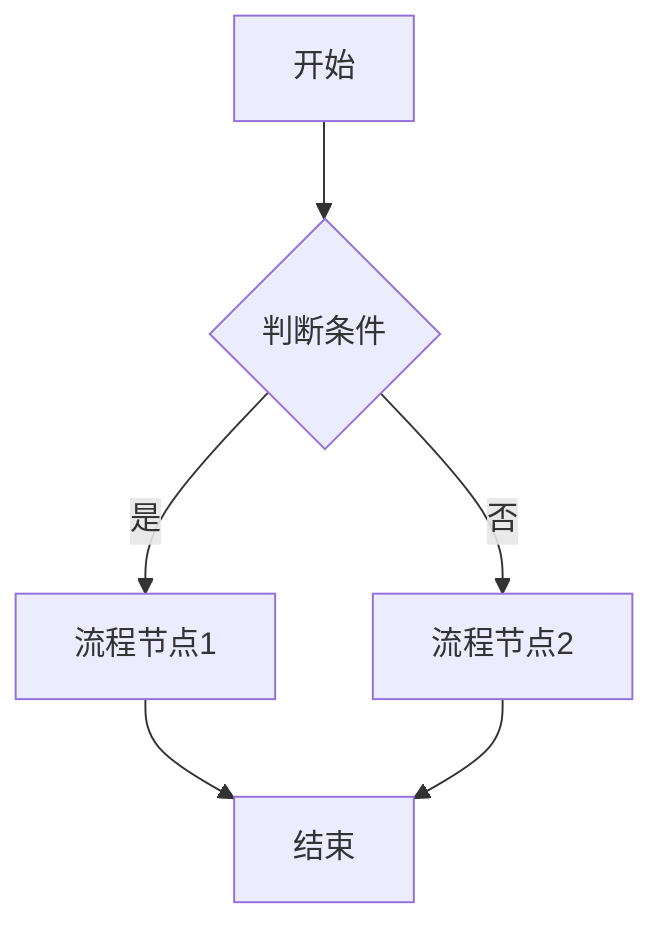

# 业务说明书模板 (Business Specification Template)

## 1. 业务背景 (Business Background)
- **背景**: [描述背景]
- **目标**: [描述目标]
- **用户**: [涉及的角色]

## 2. 业务流程 (Business Workflow)

## 3. 功能需求 (Functional Requirements)

| 编号 | 功能名称 | 优先级 | 描述 | 验收标准 |
| :--- | :--- | :--- | :--- | :--- |
| F01 | [功能名] | P0 | [详细描述] | [验收点] |

## 4. 数据模型 (Data Model)

### 实体: [Entity Name]
- Field1: Type, Description
- Field2: Type, Description

## 5. 接口清单 (API List)

| 方法 | 路径 | 描述 | 关联功能 |
| :--- | :--- | :--- | :--- |
| GET | /api/v1/resource | 查询资源列表 | F01 |
| POST | /api/v1/resource | 创建资源 | F01 |
