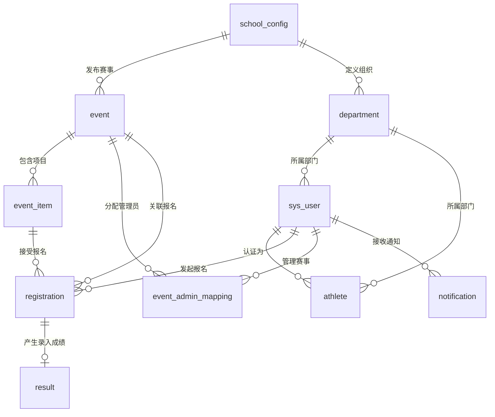

# LZ Sports 数据库设计与数据模型分析

## 1. 数据库概述
LZ Sports 采用 MySQL 关系型数据库，库名为 `lz_sports`。整个系统涉及用户、组织架构、赛事活动、比赛项目、报名及成绩等多个业务模块。所有的表默认采用 `utf8mb4` 字符集，并且绝大多数表包含了标准的审计字段：`create_time`（创建时间）和 `update_time`（更新时间）。

## 2. 核心实体关系图 (ER Diagram)

## 3. 核心数据表详解

### 3.1 组织架构与用户模块
* **`school_config` (学校配置表)**
  - 核心字段：`school_name`, `logo_url`, `theme_color`, `org_mode` (UNIVERSITY/K12), `is_initialized`
  - 作用：支持多租户（通过 `school_id`）及不同的学校组织模式（大学模式 或 K12 模式），决定了前端的主题色及后台的部门树形态。
* **`department` (部门/组织架构表)**
  - 核心字段：`college`, `major`, `grade`, `class_name`, `dept_name`, `org_mode`
  - 作用：采用扁平化宽表设计，兼容大学模式（学院-专业-班级）和 K12 模式（年级-班级）。
* **`sys_user` (系统用户表)**
  - 核心字段：`username`, `password`, `email`, `user_type` (SCHOOL_ADMIN/EVENT_ADMIN/ATHLETE), `status` (PENDING/ACTIVE/REJECTED), `is_first_login`
  - 作用：系统的登录主体，支持三种角色权限，并且针对首次登录强制修改密码设计。
* **`athlete` (运动员信息表)**
  - 核心字段：`user_id`, `event_id`, `name`, `gender`, `athlete_state` (PENDING/APPROVED/REJECTED)
  - 作用：由于同一用户在不同赛事中可能有不同的参赛身份状态，故此处增加了 `user_id` 与 `event_id` 的联合唯一约束（`uk_user_event`）。

### 3.2 赛事与报名模块
* **`event` (赛事活动表)**
  - 核心字段：`name`, `status` (DRAFT/PUBLISHED/ENDED), `reg_start_time`, `reg_deadline`, `start_time`, `end_time`
  - 作用：记录大型运动会的生命周期。
* **`event_admin_mapping` (赛事管理员关联表)**
  - 核心字段：`event_id`, `user_id`
  - 作用：实现赛事与多个赛事管理员之间的多对多映射，进行数据级权限控制。
* **`event_item` (比赛项目表)**
  - 核心字段：`event_id`, `name`, `gender_limit`, `limit_dept_ids`, `max_count`, `current_count`
  - 作用：挂载在赛事下的具体项目（如 100米、跳远等）。支持性别限制和部门权限限制（JSON 格式）。
* **`registration` (报名记录表)**
  - 核心字段：`user_id`, `event_id`, `item_id`, `status` (审核中/通过/拒绝), `reject_reason`
  - 作用：记录用户的报名流水，具有 `user_id` 和 `item_id` 的唯一约束，防止重复报名。

### 3.3 成绩与消息通知模块
* **`result` (成绩记录表)**
  - 核心字段：`registration_id`, `score_value`, `score_rank`, `is_published`
  - 作用：与报名记录一对一绑定（`uk_registration`）。成绩数值为字符串格式（如 "10.5s", "1.8m"），方便适配径赛和田赛的不同单位；`is_published` 控制成绩是否对学生端展示。
* **`notification` (系统通知表)**
  - 核心字段：`user_id`, `title`, `content`, `type` (SYSTEM/EVENT/RESULT), `is_read`
  - 作用：站内信功能，包含系统级、赛事级和成绩级的通知。

### 3.4 附件存储
* **`sportsimg` (图片资源表)**
  - 核心字段：`img_type`, `type_id`, `img_src`
  - 作用：作为通用附件表，管理赛事封面、学校 Logo、轮播图等各种类型的图片资源映射。

## 4. 设计亮点与考量
1. **统一的用户体系与分离的运动员状态**：`sys_user` 为全局账号，而 `athlete` 作为针对特定赛事的准入申请，保证了历史赛事的运动员档案数据不受未来修改的影响。
2. **宽表化部门设计 (`department`)**：没有采用传统的递归树（`parent_id`），而是通过 `college/major/class` 的宽表字段设计。由于学校层级固定（最多3-4层），这种设计极大简化了 SQL 查询和业务层组装逻辑。
3. **状态机机制**：`event`（DRAFT -> PUBLISHED -> ENDED）、`registration` 和 `athlete` 等表均采用了清晰的状态字段，方便配合定时任务（如 Spring Scheduler）实现状态自动流转。
